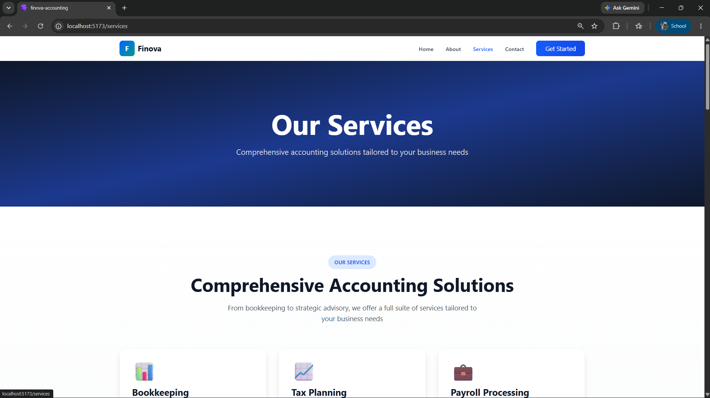
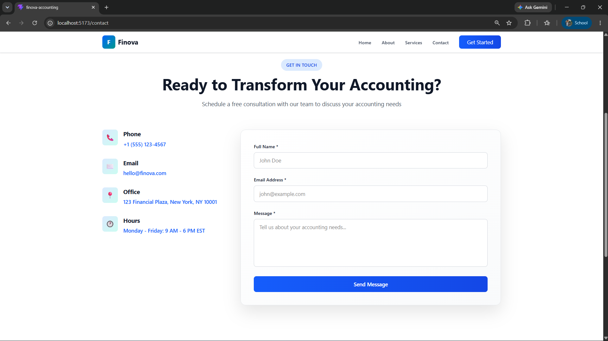

# 🏢 Finova Accounting Website

A modern, responsive accounting firm website built using:

- React + TypeScript
- Tailwind CSS
- React Router DOM
- Framer Motion

---

## 🚀 Features

- Fully responsive design (mobile, tablet, desktop)
- Modern UI with clean layout
- Smooth animations
- Reusable components
- Multi-page routing
- Professional business design

---

## 📄 Pages

- Home
- About
- Services
- Contact

---

## 🧩 Components

- Navbar (responsive mobile menu)
- Hero section
- Services section
- About section
- Stats section
- Testimonials
- FAQ
- Contact form
- Footer

---

## 🎨 Design Style

- Blue & teal professional theme
- Clean spacing
- Card-based layout
- Modern gradients
- Smooth hover animations

---

## 📱 Responsive Design

Works on:

- Mobile devices
- Tablets
- Desktop screens

---

## ⚙️ Installation

```bash
npm install
npm run dev
```

---

## 🚀 Build

```bash
npm run build
```

---

## 🌐 Deployment

Deploy easily on:

- Vercel
- Netlify

---

## 📸 Screenshots

### Home Page


### Services Section



### Contact Page



---

## 👨‍💻 Author

Built by Silal Khan using React + Tailwind CSS

---

/screenshots/
home.png
services.png
contact.png

```

```
